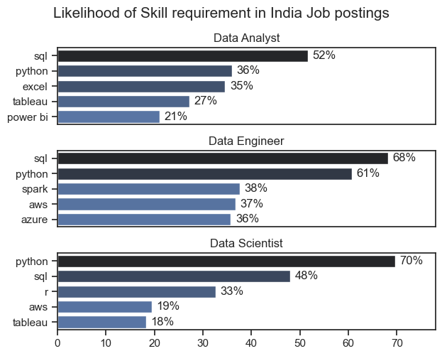
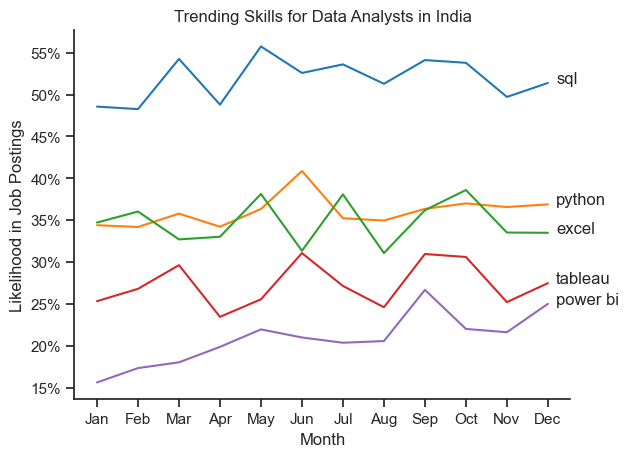
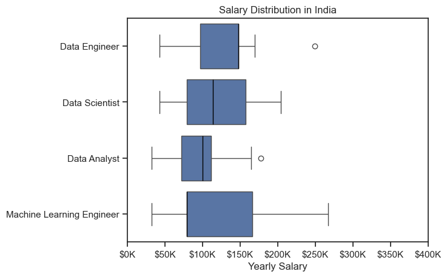
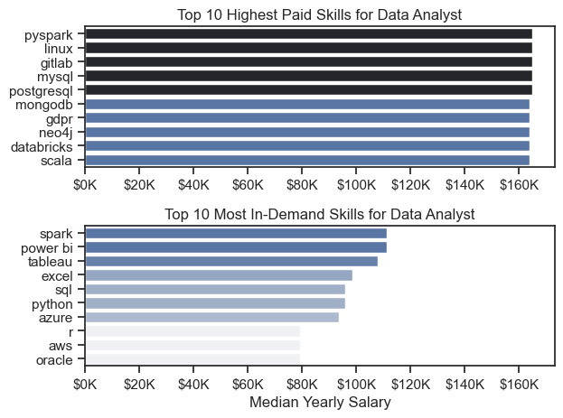

# Overview
Welcome to my analysis of the data job market, focusing on data analyst roles. This project was created out of a desire to navigate and understand the job market more effectively. It delves into the top-paying and in-demand skills to help find optimal job opportunities for data analysts.

The data sourced from [Luke Barousse's Python](https://www.lukebarousse.com/python) Course which provides a foundation for my analysis, containing detailed information on job titles, salaries, locations, and essential skills. Through a series of Python scripts, I explore key questions such as the most demanded skills, salary trends, and the intersection of demand and salary in data analytics.

## The Questions
### Below are the questions I want to answer in my project:

1. What are the skills most in demand for the top 3 most popular data roles?
2. How are in-demand skills trending for Data Analysts?
3. How well do jobs and skills pay for Data Analysts?
4. What are the optimal skills for data analysts to learn? (High Demand AND High Paying)
## Tools I Used
For my deep dive into the data analyst job market, I harnessed the power of several key tools:

- Python: The backbone of my analysis, allowing me to analyze the data and find critical insights.I also used the following Python libraries:
    - Pandas Library: This was used to analyze the data.
    - Matplotlib Library: I visualized the data.
    - Seaborn Library: Helped me create more advanced visuals.
- Jupyter Notebooks: The tool I used to run my Python scripts which let me easily include my notes and analysis.
- Visual Studio Code: My go-to for executing my Python scripts.
- Git & GitHub: Essential for version control and sharing my Python code and analysis, ensuring collaboration and project tracking.
## Data Preparation and Cleanup
This section outlines the steps taken to prepare the data for analysis, ensuring accuracy and usability.
I start by importing necessary libraries and loading the dataset, followed by initial data cleaning tasks to ensure data quality.

### Import & Clean Up Data

```python
# Importing Libraries
import ast
import pandas as pd
import seaborn as sns
from datasets import load_dataset
import matplotlib.pyplot as plt  

# Loading Data
dataset = load_dataset('lukebarousse/data_jobs')
df = dataset['train'].to_pandas()

# Data Cleanup
df['job_posted_date'] = pd.to_datetime(df['job_posted_date'])
df['job_skills'] = df['job_skills'].apply(lambda x: ast.literal_eval(x) if pd.notna(x) else x)
```

## Filter India Jobs
To focus my analysis on the India's job market, I apply filters to the dataset, narrowing down to roles based in India.
```python
df_ind = df[df['job_country']=='India']
```
# The Analysis
Each Jupyter notebook for this project aimed at investigating specific aspects of the data job market. Here’s how I approached each question:

## 1. What are the most demanded skills for the top 3 most popular data roles in India ?
To find the most demanded skills for the top 3 most popular data roles. I filtered out those positions by which ones were the most popular, and got the top 5 skills for these top 3 roles. This query highlights the most popular job titles and their top skills, showing which skills I should pay attention to depending on the role I'm targeting.

Visit my jupyter notebook for details [2_Skill_demand.ipynb](Project/2_Skill_demand.ipynb)

### Visualize Data
```python
for i , job in enumerate(job_titles):
    df_filtered = df_skills_perc[df_skills_perc['job_title_short']== job].head(5)
    
    sns.barplot(
        data = df_filtered, x='percent', y='job_skills', ax=ax[i], legend=False, hue='skill_count',
        palette='dark:b_r')
```
#### Results


*Bar graph visualizing the salary for the top 3 data roles and their top 5 skills associated with each.*

### Insights
- SQL is the most requested skill for Data Analysts and Data Engineers, with it in over half the job postings for both roles. For Data Scientist, Python is the most sought-after skill, appearing in 70% of job postings.
- Data Engineers require more specialized technical skills (AWS, Azure, Spark) compared to Data Analysts and Data Scientists who are expected to be proficient in more general data management and analysis tools (Excel, Tableau).
- Python is a versatile skill, highly demanded across all three roles, but most prominently for Data Scientists (70%) and Data Engineers (61%).

## 2. How are in-demand skills trending for Data Analysts?
To find how skills are trending in 2023 for Data Analysts, I filtered data analyst positions and grouped the skills by the month of the job postings. This got me the top 5 skills of data analysts by month, showing how popular skills were throughout 2023.

Visit my notebook for detailed analysis: [3_Skills_Trend.ipynb](Project/3_Skills_Trend.ipynb)

### Visualize Data
```python
sns.lineplot(data= df_plot, dashes=False, palette='tab10', legend=False)
sns.despine()

plt.title('Trending Skills for Data Analysts in India')
plt.ylabel('Likelihood in Job Postings')

from matplotlib.ticker import PercentFormatter
ax= plt.gca()
ax.yaxis.set_major_formatter(PercentFormatter(decimals=0))

for i in range(5):
    plt.text(11.2, df_plot.iloc[-1,i], df_plot.columns[i])

plt.show()
```
#### Results


*Line Chart visualizing the trending top skills for data analysts in the India in 2023.*
### Insights
- SQL remains the most consistently demanded skill throughout the year, although it shows a gradual decrease in demand.
- Excel experienced a significant decrease in demand starting around October, falling below python.
- Python show relatively stable demand throughout the year with some fluctuations but remain essential skills for data analysts.     
- Power BI and Tableau, while less demanded compared to the others, show significant upward trends towards the year's end.

## 3. How well do jobs and skills pay for Data Analysts?
To identify the highest-paying roles and skills, I only got jobs in the India and looked at their median salary. But first I looked at the salary distributions of common data jobs like Data Scientist, Data Engineer, and Data Analyst, to get an idea of which jobs are paid the most.

View my notebook with detailed steps here: [4_Salary_Analysis.ipynb](Project/4_Salary_Analysis.ipynb)
### Visualize Data 
```python
sns.boxplot(data=df_ind_top, 
            x='salary_year_avg', 
            y='job_title_short', 
            order= top_titles, 
            medianprops={'color':'black', 'linewidth':1})
```
#### Results


*Box plot visualizing the salary distributions for the top 6 data job titles.*
### Insights
- Machine Learning Engineers have the widest salary range, indicating significant variation depending on factors like experience, company size, and project complexity.
- Data Analysts have the narrowest range, showing more predictable pay but less room for very high earnings.
- Data Engineer and Data Analyst categories both show clear high-earning outliers, suggesting that exceptional performers (or certain niche industries) can push well beyond typical salaries.
- The absence of extreme outliers in Machine Learning Engineer and Data Scientist salaries may indicate a more consistent top-end cap in those roles.
## Highest Paid & Most Demanded Skills for Data Analysts
Next, I narrowed my analysis and focused only on data analyst roles. I looked at the highest-paid skills and the most in-demand skills. I used two bar charts to showcase these.
### Visualize Data
```python
fig, ax = plt.subplots(2,1)
sns.set_theme(style = 'ticks')
sns.barplot(data = df_DA_Tpay, x='median', y=df_DA_Tpay.index, ax=ax[0], hue = 'median',legend=False, palette='dark:b_r')
plt.show()
```
#### Results

### Insights
- The top graph shows specialized technical skills like pyspark, databricks, and Gitlab are associated with higher salaries, some reaching up to $170K, suggesting that advanced technical proficiency can increase earning potential.

- The bottom graph highlights that foundational skills like Excel, Python, and SQL are the most in-demand, even though they may not offer the highest salaries. This demonstrates the importance of these core skills for employability in data analysis roles.

- There's a clear distinction between the skills that are highest paid and those that are most in-demand. Data analysts aiming to maximize their career potential should consider developing a diverse skill set that includes both high-paying specialized skills and widely demanded foundational skills.

## 4. What are the most optimal skills to learn for Data Analysts?
To identify the most optimal skills to learn ( the ones that are the highest paid and highest in demand) I calculated the percent of skill demand and the median salary of these skills. To easily identify which are the most optimal skills to learn.

View my notebook with detailed steps here: [5_Most_optimal_skill.ipynb](Project/5_Most_optimal_skill.ipynb)
### Visualize Data
```python
df_DA_high_dem.plot(kind='scatter',x='skill_percent', y='median_salary')
texts = []
for i, txt in enumerate(df_DA_high_dem.index):
    texts.append(
        plt.annotate(txt, (df_DA_high_dem['skill_percent'].iloc[i], df_DA_high_dem['median_salary'].iloc[i]))
        )
```
#### Results
.png)

### Insights
- The scatter plot shows that most of the programming skills (colored blue) tend to cluster at higher salary levels compared to other categories, indicating that programming expertise might offer greater salary benefits within the data analytics field.
- Analyst tools (colored orange), including Tableau and Power BI, are prevalent in job postings and offer competitive salaries, showing that visualization and data analysis software are crucial for current data roles. This category not only has good salaries but is also versatile across different types of data tasks.
## What I Learned
Throughout this project, I deepened my understanding of the data analyst job market and enhanced my technical skills in Python, especially in data manipulation and visualization. Here are a few specific things I learned:

- **Advanced Python Usage :** Utilizing libraries such as Pandas for data manipulation, Seaborn and Matplotlib for data visualization, and other libraries helped me perform complex data analysis tasks more efficiently.
- **Data Cleaning Importance :** I learned that thorough data cleaning and preparation are crucial before any analysis can be conducted, ensuring the accuracy of insights derived from the data.
- **Strategic Skill Analysis :** The project emphasized the importance of aligning one's skills with market demand. Understanding the relationship between skill demand, salary, and job availability allows for more strategic career planning in the tech industry.
## Challenges I Faced
This project was not without its challenges, but it provided good learning opportunities:

- **Data Inconsistencies :** Handling missing or inconsistent data entries requires careful consideration and thorough data-cleaning techniques to ensure the integrity of the analysis.
- **Complex Data Visualization :** Designing effective visual representations of complex datasets was challenging but critical for conveying insights clearly and compellingly.
- **Balancing Breadth and Depth :** Deciding how deeply to dive into each analysis while maintaining a broad overview of the data landscape required constant balancing to ensure comprehensive coverage without getting lost in details.
# Conclusion
This exploration into the data analyst job market has been incredibly informative, highlighting the critical skills and trends that shape this evolving field. The insights I got enhance my understanding and provide actionable guidance for anyone looking to advance their career in data analytics. As the market continues to change, ongoing analysis will be essential to stay ahead in data analytics. This project is a good foundation for future explorations and underscores the importance of continuous learning and adaptation in the data field.
